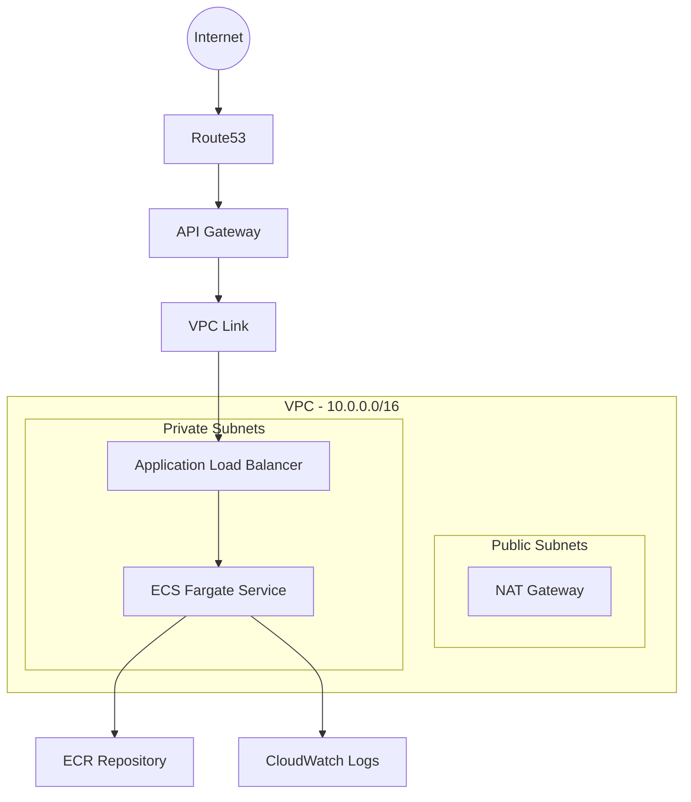
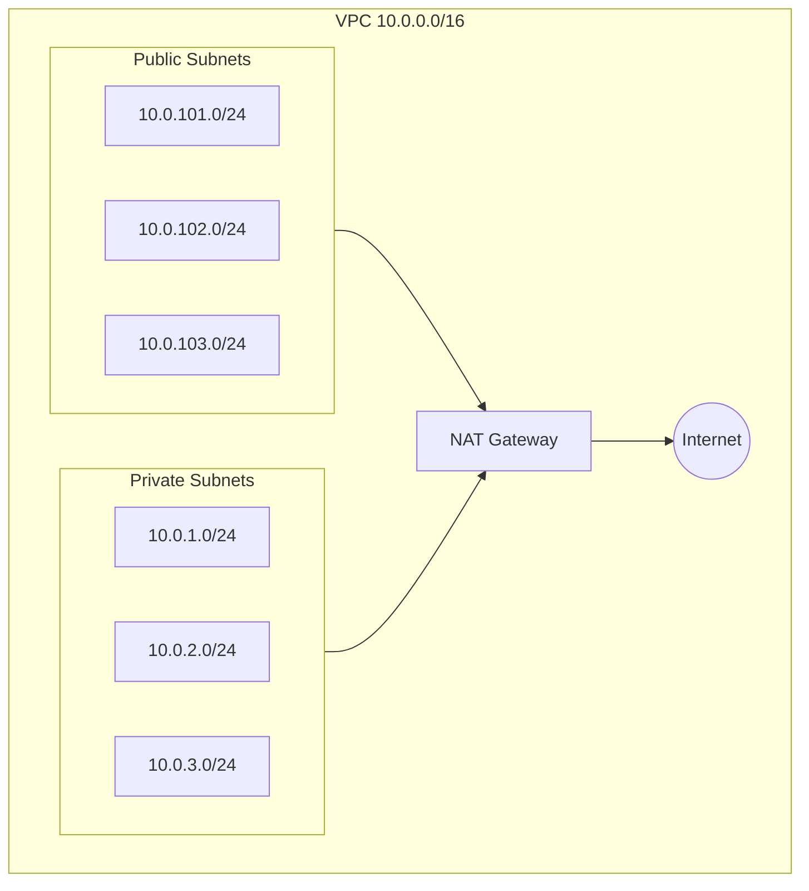

# Infrastructure Overview

This repository contains Terraform configurations for deploying a Laravel application on AWS using ECS Fargate. The infrastructure is designed with security, scalability, and high availability in mind.

## Architecture Overview

The infrastructure consists of the following main components:

- VPC with public and private subnets across 3 availability zones
- ECS Fargate cluster for container orchestration
- Application Load Balancer (ALB) for traffic distribution
- API Gateway for API management and endpoint exposure
- ECR repository for container image storage
- CloudWatch for monitoring and logging
- Route53 for DNS management

### Infrastructure Diagram

## Key Features

- **High Availability**: Deployed across 3 AZs with auto-scaling capabilities
- **Security**: 
  - Private subnets for application workloads
  - Layered security groups
  - VPC Flow Logs enabled
  - Container scanning in ECR
- **Scalability**:
  - Auto-scaling based on CPU and Memory metrics
  - Mixed usage of Fargate and Fargate Spot for cost optimization
- **Monitoring**:
  - CloudWatch Container Insights enabled
  - CloudWatch Alarms for CPU and Memory
  - API Gateway access logging
  - VPC Flow Logs

## Resource Specifications

### ECS Service Configuration
- CPU: 256
- Memory: 512MB
- Minimum Healthy Percent: 50%
- Maximum Percent: 200%
- Auto-scaling: 2-4 tasks
- Health Check Path: `/health`

### Auto-scaling Thresholds
- CPU Target: 70%
- Memory Target: 80%
- High CPU Alarm: 85%
- High Memory Alarm: 85%

## Networking Architecture

## State Management
- Backend: S3 with DynamoDB locking
- Bucket: `laravel-app-terraform-state-bucket`
- DynamoDB Table: `laravel-app-terraform-state-lock`

## Prerequisites
- AWS CLI configured
- Terraform >= 1.0
- ACM Certificate for domain
- Required IAM permissions

## Important Notes
- The application is exposed via API Gateway at `margaretriver.rentals`

# Deployment Steps

## Prerequisites

### Local CLI Tools
1. Docker
2. AWS CLI
3. Terraform CLI

### Cloud Accounts
1. AWS Account

### Certificates and Domains
1. ACM Certificate for `margaretriver.rentals`
2. Domain configured in Route53 for `margaretriver.rentals`

## Provision Remote State
An S3 bucket and DynamoDB table are used to store the remote state of the terraform code. I've provisioned this locally and stored the state in the `remote-state` folder. There are no expected changes to the remote state infra which is why it is not included in infra automation. 

1. cd remote-state
2. terraform init
3. terraform apply

## Configure Github Actions
1. Create a new repository secret with the name `AWS_ACCESS_KEY_ID` and `AWS_SECRET_ACCESS_KEY`

## Deploy Infra
Infrastructure is provisioned using terraform. The code is located in the `infra` folder. To provision the infra, run the following commands or the deploy-infra.yaml workflow will be triggered on push to the `main` branch.

1. cd infra
2. terraform init
3. terraform apply

Or

1. Push to the `main` branch with changes to /infra

## Deploy App Locally

1. cd app
2. docker build -t laravel-app .
3. docker run -p 8000:8000 laravel-app
4. navigate to http://localhost:8000

## Deploy App to ECS

1. Push to the `main` branch with changes to /app

## DNS
For the domain resolution to work, you will need to :
1. Create a public hosted zone in Route53 for `margaretriver.rentals`
2. Create a certificate in ACM for `margaretriver.rentals`
3. Verify the ownership of the domain in ACM

